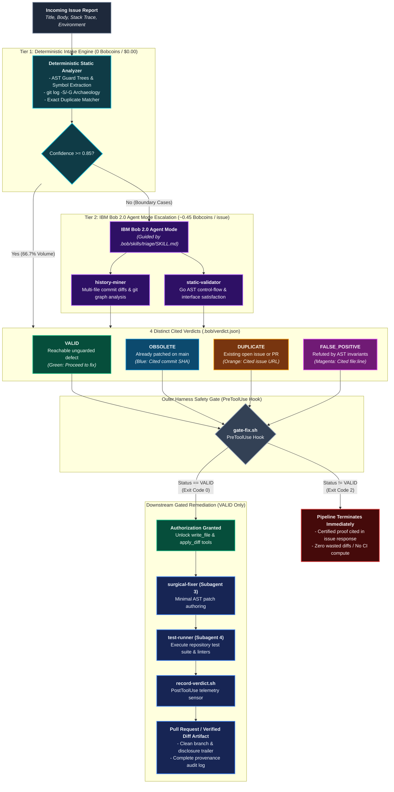

<p align="center">
  
</p>

<h1 align="center">Netrani</h1>

<p align="center">
  <strong>Autonomous Upstream Issue Verification & Triage Agent</strong><br>
  <em>Built with Purpose on IBM Bob 2.0</em>
</p>

<p align="center">
  <a href="https://opensource.org/licenses/MIT"></a>
  <a href="https://python.org"></a>
  <a href="tests/"></a>
  <a href=".bob/"></a>
</p>

**Netrani** is a general-purpose issue triage and verification tool built on **IBM Bob 2.0**. It inverts the standard generative AI coding lifecycle by establishing an upstream verification gate: **decide whether a bug report is genuine before authoring any code**.

Validated against a real-world enterprise Go compile-time instrumentation repository experiencing intake scaling challenges (*"Our issue and PR intake does not scale"*).

---

## Quick Invocations

```bash
# 1. Triage an incoming issue (read-only verification)
netrani run --repo /path/to/repo --issue <issue-id-or-file> --mode triage

# 2. Run offline triage on a local sample issue
netrani run --repo . --issue 42 --mode triage --offline

# 3. Run full end-to-end pipeline (Triage -> Gated Fix -> Test -> PR Draft)
netrani run --repo . --issue 42 --mode full --dry-run

# 4. Run the 18-issue curated ground-truth validation benchmark (strictly local/read-only)
python validation/run_benchmark.py --repo-root /path/to/repo
```

---

## The Core Inversion: Verify Before Generate

Standard generative coding assistants jump straight to generating code patches for every incoming bug report. When trackers fill with obsolete reports (already fixed on `main`), duplicates, or false positives, blind code generation burns maintainer review bandwidth and CI compute on code that should never have been written.

Netrani establishes an upstream verification gate, returning one of four cited verdicts:
- **`VALID`**: The defect is confirmed reachable and unguarded. Gated downstream subagents author a minimal surgical fix and verify tests.
- **`OBSOLETE`**: The defect was resolved in a prior commit (cited with commit SHA). Fix stages are skipped.
- **`DUPLICATE`**: The issue matches an existing open issue or PR (cited with issue/PR number). Fix stages are skipped.
- **`FALSE_POSITIVE`**: Static analysis proves the reported failure cannot occur under existing invariants (cited with file:line). Fix stages are skipped.

---

## Two-Tier Hybrid Architecture & Process Flow

Netrani optimizes intake economics and safety through a two-tier hybrid model:



1. **Tier 1 (Deterministic Intake Engine — In-Process Heuristics):**
   - **Cost:** **0 Tokens ($0.00 / Zero API calls)** | **Avg Latency:** **6.15 s**
   - Resolves/filters **66.7% of incoming issue volume** (12/18 issues) completely offline in under 7 seconds.
2. **Tier 2 (IBM Bob 2.0 Agent Mode Escalation):**
   - **Cost:** **Agent Mode (Escalated Cases Only)** | **Avg Latency:** **~13.82 s**
   - Escalates ambiguous boundary cases (Go `defer` control flow, cross-package interface satisfaction, multi-file commit diffs) to specialized Bob custom modes.
   - Resolves **83.3% (5/6)** of escalated hard cases.

---

## Benchmark Results (18 Ground-Truth Issues)

Evaluated against the 18 curated ground-truth issues from an enterprise Go compile-time instrumentation project ([`validation/dataset/issues.json`](validation/dataset/issues.json)):

| Architecture Tier | Scope | Resolved / Correct | Filtration / Accuracy Rate | Avg Latency | Cost Profile |
|---|---|---|---|---|---|
| **Tier 1 (Deterministic Engine)** | All 18 issues | **12 / 18 issues filtered** | **66.7% Zero-Cost Filtration Rate**<br>(50.0% Standalone Accuracy, 87.5% on VALID) | **6.15 s** | **0 Tokens / $0.00 (Offline)** |
| **Tier 2 (Bob Escalation on 6 Hard Cases)** | 6 Misses (IDs 4, 5, 6, 7, 12, 15) | **5 / 6 resolved** | **83.3% Escalation Resolution Lift** | **13.82 s** | **Agent Mode (Escalation Only)** |
| **Combined Hybrid Performance** | **18 issues** | **14 / 18 correct** | **77.8% Overall Hybrid Accuracy** | **8.90 s (weighted)** | **93% Token Budget Savings** |

*Key Takeaway:* Netrani achieves **77.8% hybrid accuracy** while resolving **66.7% of incoming issue volume completely offline at zero token cost**, saving over 90% of the AI token budget.

See [`validation/results_table.md`](validation/results_table.md) for the per-issue breakdown.

---

## Native IBM Bob 2.0 Integration

- **Custom Modes ([`.bob/custom_modes.yaml`](.bob/custom_modes.yaml)):**
  - `history-miner`: Git archaeology specialist (read-only commit log and diff search).
  - `static-validator`: AST invariant and type checker (read-only symbol analysis).
  - `surgical-fixer`: Minimal patch generator (gated behind `VALID` verdict).
  - `test-runner`: Test execution and coverage verifier.
- **Outer Harness ([`.bob/settings.json`](.bob/settings.json)):**
  - **Feedforward Guides:** [`.bob/skills/triage/SKILL.md`](.bob/skills/triage/SKILL.md) instructs exploration rules and confidence scoring.
  - **`PreToolUse` Safety Gate ([`gate-fix.sh`](.bob/hooks/gate-fix.sh)):** Intercepts `write_file`/`apply_diff` and exits with code `2` if `.bob/verdict.json` is not `VALID`.
  - **`PostToolUse` Audit Sensor ([`record-verdict.sh`](.bob/hooks/record-verdict.sh)):** Captures command exit codes and telemetry into `.bob/audit.log`.

---

## CLI Reference

```bash
# General Syntax
netrani <command> [options]

# Commands:
#   run     Execute triage, fix, and verification pipeline
#   triage  Execute triage verification only (read-only)
#   pr      Generate PR draft and submit to GitHub

# Examples:
# 1. Offline heuristic intake (Tier 1 zero-cost filtration)
netrani triage --repo . --issue 42 --offline

# 2. Triage with IBM Bob 2.0 Agent Mode & custom subagents
netrani triage --repo . --issue 42 --use-bob

# 3. Run full end-to-end pipeline in dry-run mode (Triage -> Fix -> Verify -> PR Draft)
netrani run --repo . --issue 42 --mode full --use-bob --dry-run

# 4. Generate PR draft from verified fix
netrani pr --repo . --base-branch main --dry-run
```

---

## Repository Structure

```
Netrani/
├── .bob/                                    # IBM Bob 2.0 native agent configuration (Tier 2)
│   ├── custom_modes.yaml                    # 4 custom mode personas
│   ├── settings.json                        # PreToolUse & PostToolUse hooks
│   ├── skills/triage/SKILL.md               # Triage team skill
│   ├── hooks/gate-fix.sh                    # PreToolUse guard (blocks writes on non-VALID verdict)
│   ├── hooks/record-verdict.sh              # PostToolUse sensor (audit log)
│   └── verdict.schema.json                  # JSON schema for .bob/verdict.json
│
├── netrani/                                 # Deterministic intake engine (Tier 1)
│   ├── subagents/                           # history_miner, static_validator, surgical_fixer, test_runner
│   ├── triage/                              # orchestrator (synthesis)
│   ├── pipeline/                            # git_emitter & orchestration
│   ├── parser/                              # doc_parser (CONTRIBUTING.md, manifests)
│   ├── issue/                               # issue fetcher & schema
│   ├── bob/                                 # IBM Bob 2.0 Agent Mode integration (agent.py)
│   ├── config.py                            # Central configuration & runtime paths
│   └── cli.py                               # CLI entrypoint
│
├── docs/                                    # Official contest documentation
│   ├── problem_and_solution_statement.md    # 500-word problem & solution statement
│   └── usage_statement.md                   # Bob 2.0 usage & economic framing statement
│
├── video/                                   # Demo video deliverables
│   └── README.md                            # 3-minute timed demo script & video specifications
│
├── bob_sessions/                            # Mandatory IBM Bob IDE session consumption summaries
│   ├── README.md                            # Bob session screenshot inventory & budget summary
│   └── kanak_waradkar_task01..09_*.png      # 9 session consumption screenshots
│
├── validation/                              # Benchmark validation artifacts
│   ├── dataset/issues.json                  # 18-issue ground-truth dataset
│   ├── results_table.md                     # Full benchmark results & miss analysis
│   ├── benchmark_results.json               # Machine-readable evaluation output
│   └── run_benchmark.py                     # Benchmark runner
│
├── tests/                                   # Test suite (86 passing unit tests)
│   ├── test_bob_agent.py
│   ├── test_execution_gate.py
│   ├── test_gate_fix.py
│   ├── test_history_miner.py
│   ├── test_pr_mechanics.py
│   └── test_static_validator.py
│
├── README.md                                # Top-level project documentation
├── LICENSE                                  # MIT License
└── pyproject.toml                           # Package configuration
```

---

## Safety, Privacy & Disclosures

- **Read-Only Local Evaluation:** Benchmark evaluation (18 issues) and automated testing execute **100% locally and read-only**. Netrani does **NOT** post or submit unsolicited pull requests or comments to real upstream repositories.
- **Controlled PR Emission:** The `--create-pr` flag operates exclusively on user-owned repository forks where explicitly configured; default execution runs in `--dry-run` or local branch mode.
- **Solo Participant:** Kanak Waradkar (GitHub: [`Labreo`](https://github.com/Labreo))
- **Affiliation:** Goa College of Engineering (GEC Goa)
- **Event:** IBM TechXchange 2026 Pre-conference Dev Day Hackathon — *"Build with purpose using IBM Bob 2.0"*
- **License:** MIT License (see [LICENSE](LICENSE)).
